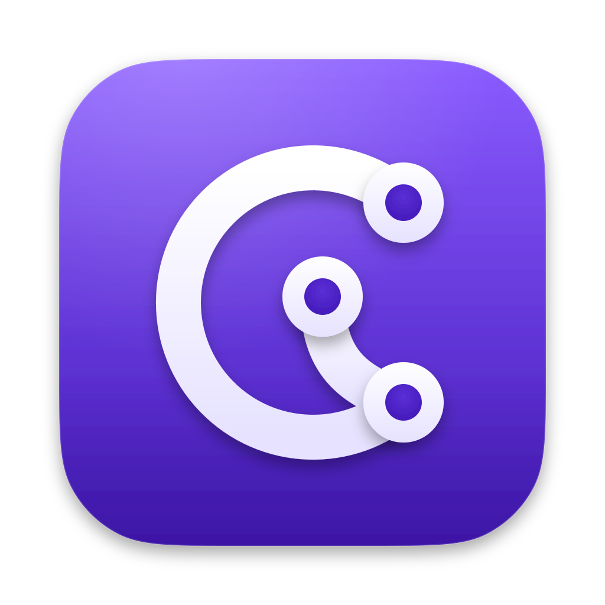

<p align="center"></p>

# Corvane

A native, fast, low-memory GitHub Desktop clone written in Rust.

The UI is a one-to-one recreation of GitHub Desktop 3.6.6: same layout, buttons, menus, dialogs and workflow. The engine is different: GPUI (Zed's GPU-accelerated UI framework) for rendering, gitoxide for in-process git reads, and the git CLI for writes so behaviour matches GitHub Desktop exactly.

Status: early development. See [PLAN.md](PLAN.md) for the roadmap and [TODO.md](TODO.md) for deferred features.

## Requirements

- macOS 15 or newer (Apple Silicon or Intel)
- `git` 2.40+ on your `PATH` (Xcode Command Line Tools or Homebrew)

## Building

```bash
cargo run -p corvane
```

Development builds compile Metal shaders at runtime so a full Xcode install is not required. Release builds in CI use precompiled shaders (`--no-default-features`).

## Install

Homebrew (recommended, avoids Gatekeeper prompts because the app is not notarized):

```bash
brew install --cask wasi-master/corvane/corvane --no-quarantine
```

Direct download from GitHub Releases: after the first launch is blocked, open System Settings → Privacy & Security and click "Open Anyway", or run `xattr -d com.apple.quarantine /Applications/Corvane.app`.

## License

MIT. See [LICENSE](LICENSE) and [NOTICE](NOTICE).
